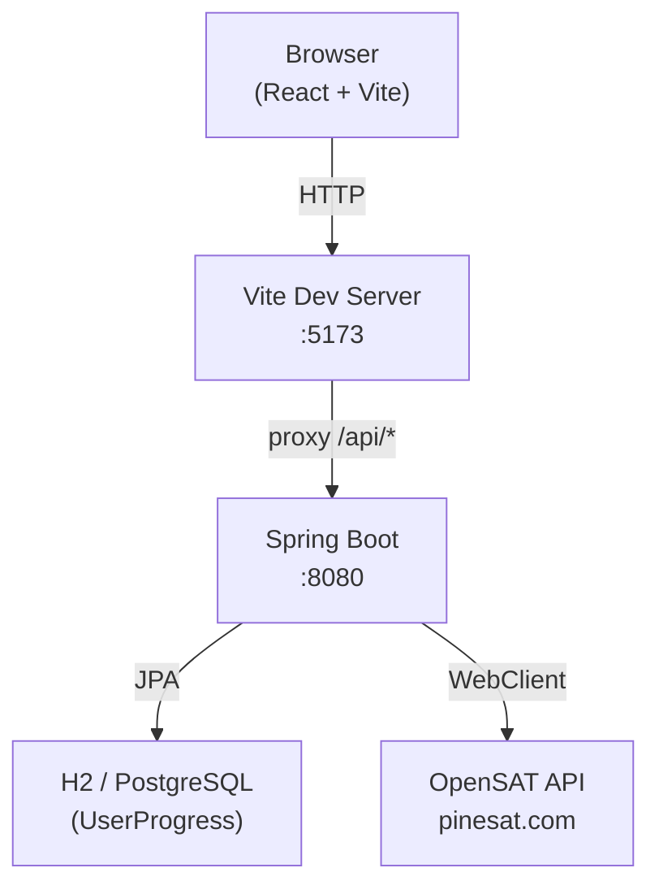
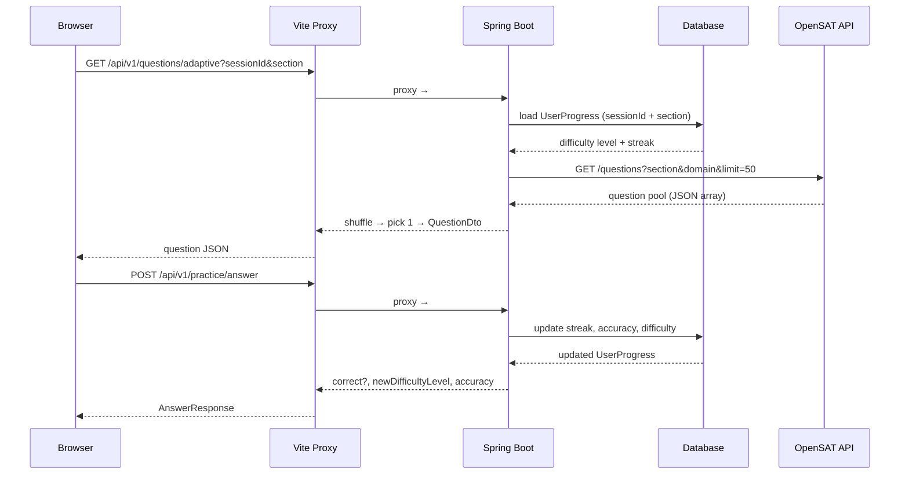
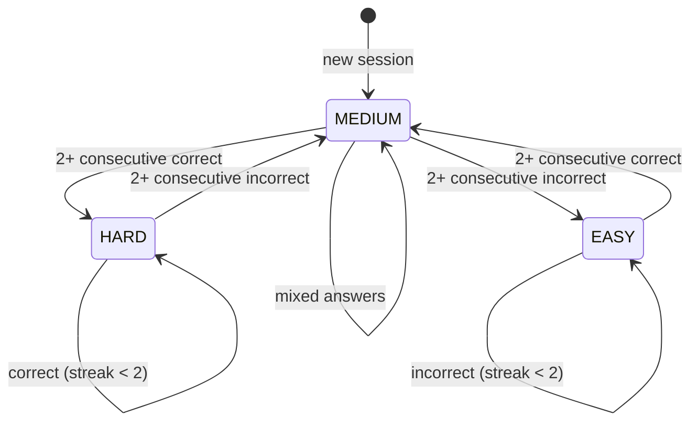

# sat-kickstart

A browser-based SAT prep tool for high school students. Serves adaptive practice questions pulled live from the [OpenSAT / PineSAT](https://github.com/Anas099X/OpenSAT) question bank (1,000+ free questions, no API key required).

**Stack:** React 18 + TypeScript (Vite) · Java 17 / Spring Boot 3 · H2 (dev) / PostgreSQL (prod)

---

## Architecture

### System overview



### Request flow — adaptive question



### Adaptive difficulty state machine



---

## Prerequisites

| Tool | Minimum version |
|------|----------------|
| Java | 17 |
| Node.js | 18 |
| npm | 9 |
| Maven | bundled (`./mvnw`) |

PostgreSQL is **not** required for local development — the dev profile uses an H2 in-memory database.

---

## Quick start (recommended)

```bash
# Clone the repo
git clone <repo-url>
cd sat-kickstart

# Start both servers with one command
./start.sh
```

`start.sh` will:
1. Auto-detect Java if it's not on your `PATH` (handles Homebrew installs on macOS)
2. Install frontend npm dependencies on first run
3. Start the Spring Boot backend on **http://localhost:8080** (H2 dev profile)
4. Start the Vite frontend on **http://localhost:5173**
5. Print a network URL so others on the same Wi-Fi can connect

Press **Ctrl+C** to stop both servers.

---

## Manual setup

### Backend

```bash
cd backend

# (Optional) copy the example env file
cp .env.example .env

# Run with the dev profile (H2 in-memory DB, no PostgreSQL needed)
./mvnw spring-boot:run -Dspring-boot.run.profiles=dev
```

The backend starts on **http://localhost:8080**.
H2 console is available at **http://localhost:8080/h2-console** (JDBC URL: `jdbc:h2:mem:sat_kickstart`).

### Frontend

```bash
cd frontend
npm install
npm run dev
```

The frontend starts on **http://localhost:5173**.

---

## Sharing with others on the same network

`start.sh` binds the Vite dev server to `0.0.0.0`, so anyone on the same Wi-Fi can open the app using your machine's local IP address (printed at startup), e.g.:

```
http://192.168.x.x:5173
```

API calls are proxied through Vite, so no extra configuration is needed for network access.

---

## Environment variables

### Backend (`backend/.env`)

| Variable | Default | Description |
|----------|---------|-------------|
| `SPRING_DATASOURCE_URL` | H2 in dev | PostgreSQL URL for production |
| `SPRING_DATASOURCE_USERNAME` | `sa` | DB username |
| `SPRING_DATASOURCE_PASSWORD` | _(empty)_ | DB password |
Copy `backend/.env.example` to `backend/.env` and edit as needed.

### Frontend (`frontend/.env.local`)

| Variable | Default | Description |
|----------|---------|-------------|
| `VITE_API_BASE_URL` | `/api/v1` (proxied) | Override to point directly at the backend |

Leave `VITE_API_BASE_URL` unset (the default) so API calls route through Vite's proxy — this works for both `localhost` and network IP access.

---

## Running tests

```bash
# Backend (JUnit 5 + Mockito)
cd backend && ./mvnw test

# Frontend (Vitest)
cd frontend && npm test
```

---

## API overview

| Method | Endpoint | Description |
|--------|----------|-------------|
| GET | `/api/v1/questions/adaptive` | Next question adapted to user difficulty |
| GET | `/api/v1/questions` | Questions by section/domain |
| POST | `/api/v1/practice/answer` | Submit an answer, get feedback + new difficulty |
| GET | `/api/v1/progress` | Per-section progress for a session |

Base path: `http://localhost:8080`

---

## Content disclaimer

All questions are sourced from the [OpenSAT](https://github.com/Anas099X/OpenSAT) community database and are **unofficial practice content** — not affiliated with or endorsed by College Board.
